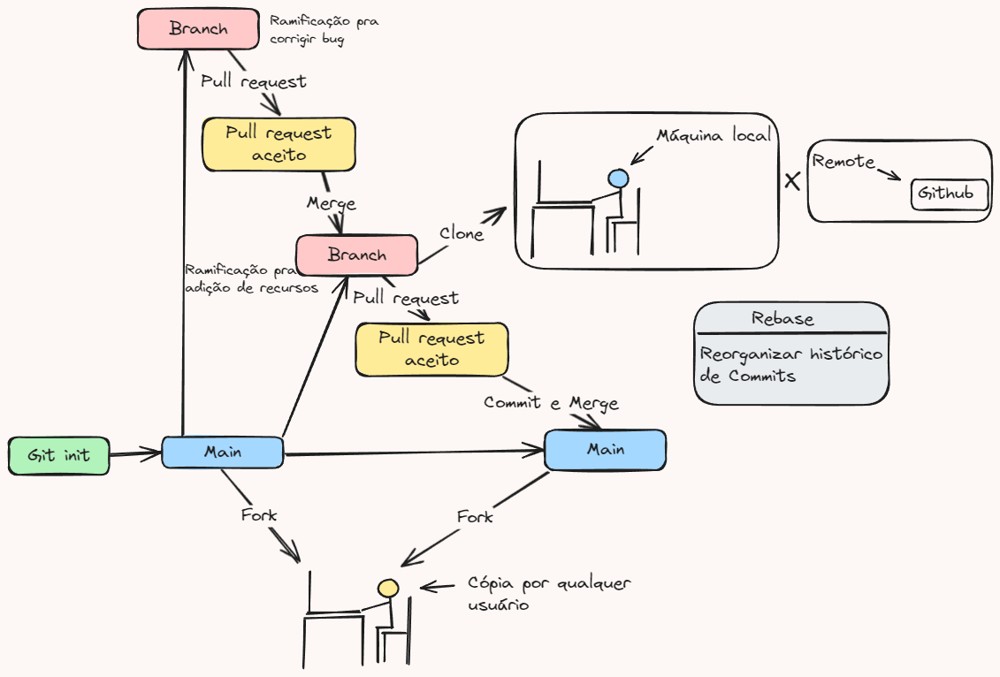

# Um repositório para entender Git e Github

Esse é um repositório que criei para concluir um desafio de um curso de Git e Github na plataforma [DIO](https://web.dio.me). Pretendo aproveitá-lo para resumir tudo que sei a respeito do Git e do Github, além de informações relacionadas. Há uma cópia do conteúdo contido aqui na wiki deste repositório, caso prefire ler por lá.

## O que é Git e Github

Para começar, é importante entender o que são as duas ferramentas utilizadas para controle de versão e colaboração de código:

### Git
1. **O que é**: 
	- **Sistema de controle de versões distribuído**.
	- Permite que os desenvolvedores acompanhem e gerenciem mudanças no código-fonte de um projeto ao longo do tempo, garantindo que diferentes versões de um software possam ser armazenadas e recuperadas.
2. **Função**: 
	- Facilita o trabalho em equipe, permitindo que vários desenvolvedores trabalhem simultaneamente no mesmo projeto sem conflitos.
	- Gerencia 
		- *branches* (ramificações);
		- *Commits* (alterações);
		- *Merges* (integrações).
1. **Tipo de plataforma**:
	- **Ferramenta de controle de versões** classificada como um **sistema de versionamento de código**.
		- Version Control System (VCS).
### GitHub
1. **O que é**:
	- Plataforma de hospedagem de repositórios Git na nuvem
	- Oferece uma interface web para gerenciamento de projetos Git, além de recursos como 
		- Colaboração em equipe;
		- Issues (relatório de problemas);
		- Pull requests (solicitação de integração de código);
		- Integração com outros serviços (CI/CD).
1. **Função**:
	- Hospedar repositórios Git;
	- Facilitar a 
		- colaboração;
		- revisão de código; 
	- Permitir que projetos open-source sejam compartilhados publicamente ou privados;
	- Serve como uma espécie de rede social para desenvolvedores.
1. **Tipo de plataforma**: 
	- **Plataforma de hospedagem de código e colaboração** para projetos Git.
### Em resumo...
- **Git** é uma ferramenta de controle de versão local e distribuída.
- **GitHub** é uma plataforma baseada na web para armazenar, compartilhar e colaborar em projetos Git.

## Funcionamento

Esse desenho que fiz no excalidraw explica bem o funcionamento de maneira resumida:

- Primeiro um novo repositório é criado localmente com o comando **git init** pelo git ou lá no site do github de maneira remota.
	- O git pode ser instalado [aqui](https://git-scm.com/download/win). 
		- Uma vez instalado, você só precisa criar um repositório, entrar nele, apertar o botão direito do mouse e clicar em abrir "abrir git bash aqui" para começar a brincadeira.
- Feito isso, o repositório já é criado automaticamente na **branch principal: a branch main**
- A partir daí, cada contribuinte do projeto já pode **clonar** o repositório em uma máquina afim de trabalhar no código **localmente** ou editar pelo próprio github **remotamente** através do github.dev.
- Também é possível que usuários do Github façam um **fork** se o repositório for público. Quando um fork é feito, um clone do repositório original é feito no perfil do usuário.
- Uma outra habilidade possibilitada é criação de outras **branchs** além da main. Tais branchs podem ser utilizadas para desenvolvimento paralelo, sendo muito mais seguro fazer alterações arriscadas nela do que na principal, por exemplo.
	- Isso torna possível fazer alterações drásticas sem afetar o código da main.
	- Mais branchs normalmente são criadas para correção de algum bug ou adição de recursos.
		- Bugs e necessidade de adição de recursos são descritos em **issues**, que são mensagens que podem ser escritas para que a equipe lembre de resolver algum problema.
- Quando uma branch perde o sentido de existência ela pode ser mesclada com outra branch, mas antes um **pull request** precisa ser criado. O pull request só será aceito se as alterações nas branchs não entrarem em conflito.
	- Caso dê conflito, ele deve ser eliminado antes.
- Quando o pull request é aceito o **merge**(mesclagem) pode ser efetuado.

## Mais sobre Git e GitHub

Caso queira aprender ainda mais sobre o conteúdo abordado, nesse repositório vou deixar alguns arquivos em markdown a respeito. Por enquanto todo conteúdo que eu estou deixando aqui partiu desse Gitbook [aqui](https://aline-antunes.gitbook.io/formacao-fundamentos-github).

### Introdução ao Git e Github
1. [O que é o Git e o Github](conteúdosEmMarkdown/O%20que%20é%20o%20Git%20e%20o%20Github.md)
2. [Como o git e o github se relacionam](conteúdosEmMarkdown/Como%20o%20git%20e%20o%20github%20se%20relacionam.md)
3. [Configuração do git depois de instalar](conteúdosEmMarkdown/Configuração%20do%20git%20depois%20de%20instalar.md)
4. [Principais comandos do Git](conteúdosEmMarkdown/Principais%20comandos%20do%20Git.md)
5. [Autenticações do GitHub](conteúdosEmMarkdown/Autenticações%20do%20GitHub.md)
6. [Tokens de Acesso Pessoal](conteúdosEmMarkdown/Tokens%20de%20Acesso%20Pessoal.md)
7. [Configurando - Chave SSH](conteúdosEmMarkdown/Configurando%20-%20Chave%20SSH.md)
8. [Configurando -  2FA](conteúdosEmMarkdown/Configurando%20-%20%202FA.md)
9. [Colaboração com o Github](conteúdosEmMarkdown/Colaboração%20com%20o%20Github.md) 
10. [Adicionar, Commitar e Enviar Arquivos para o Github](conteúdosEmMarkdown/Adicionar,%20Commitar%20e%20Enviar%20Arquivos%20para%20o%20Github.md)
11. [Formatação com o Markdown](conteúdosEmMarkdown/Formatação%20com%20o%20Markdown.md)
12. [Github Desktop](conteúdosEmMarkdown/Github%20Desktop.md)
13. [Github Web](conteúdosEmMarkdown/Github%20Web.md)
14. [Diferenças entre Github Desktop e Github Web](conteúdosEmMarkdown/Diferenças%20entre%20Github%20Desktop%20e%20Github%20Web.md)
### Produtos do Github
1. [Github Contas e Planos](conteúdosEmMarkdown/Github%20Contas%20e%20Planos.md)
2. [Sobre o Github Mobile e o Github Desktop](conteúdosEmMarkdown/Sobre%20o%20GitHub%20Certifications.md)
4. [Gerenciando seu trabalho com Github Projects](conteúdosEmMarkdown/Gerenciando%20seu%20trabalho%20com%20Github%20Projects.md)
5. [Introdução ao Github Copilot](conteúdosEmMarkdown/Introdução%20ao%20Github%20Copilot.md)
6. [Introdução ao Codespace](conteúdosEmMarkdown/Introdução%20ao%20Codespace.md)
7. [Personalizando seu Codespace](conteúdosEmMarkdown/Personalizando%20seu%20Codespace.md)
8. [Codespaces X GitHub.dev](conteúdosEmMarkdown/Codespaces%20X%20GitHub.dev.md)
9. [Introdução ao Inner Soucer](conteúdosEmMarkdown/Introdução%20ao%20Inner%20Soucer.md)
10. [Adentrando Detalhadamente o InnerSouce no Github](conteúdosEmMarkdown/Adentrando%20Detalhadamente%20o%20InnerSouce%20no%20Github.md)

### Administração do Github
1. [Conhecendo a Administração do Github](conteúdosEmMarkdown/Conhecendo%20a%20Administração%20do%20Github.md)
2. [Permissões do Github](conteúdosEmMarkdown/Permissões%20do%20Github.md)
### Material extra
1. [Gitignore](conteúdosEmMarkdown/Gitignore.md)
	1. [Conflitos gitignore](conteúdosEmMarkdown/Conflitos%20gitignore.md)
2. [Resumão sobre Github](conteúdosEmMarkdown/Resumão%20sobre%20Github.md)
### GitHub Certifications
1. [Sobre o GitHub Certifications](conteúdosEmMarkdown/Sobre%20o%20GitHub%20Certifications.md)
