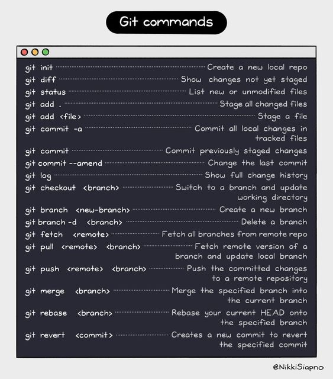

# Principais comandos do Git
 
 

1. **git init**
    - Inicia um novo repositório Git no diretório atual.
2. **git clone \[URL]**
    - Clona um repositório Git existente para o diretório local.
3. **git add .**
    - Adiciona alterações ao índice (staging area) para prepará-las para o commit.
4. **git commit -m "mensagem"**
    - Realiza um commit com as alterações adicionadas, incluindo uma mensagem que descreve as mudanças feitas.
5. **git status**
    - Exibe o estado atual do repositório, indicando quais arquivos foram modificados, adicionados ou removidos.
6. **git log**
    - Mostra o histórico de commits do repositório.
7. **git branch**
    - Lista todas as branches locais e destaca a branch atual.
8. **git branch \[nome-da-branch]**
    - Cria uma nova branch.
9. **git checkout \[nome-da-branch]**
    - Altera para uma branch específica.
10. **git merge \[branch]**
    - Combina as alterações de uma branch para a branch atual.
11. **git pull**
    - Atualiza o repositório local com as alterações do repositório remoto.
12. **git push \[remote] \[branch]**
    - Envia os commits locais para o repositório remoto.
13. **git remote -v**
    - Lista os repositórios remotos configurados.
14. **git fetch**
    - Recupera as últimas alterações do repositório remoto, mas não faz merge automaticamente.
15. **git reset [arquivo]**
    - Desfaz as alterações no arquivo especificado, removendo-o do índice.
16. **git rm [arquivo]**
    - Remove um arquivo do repositório e o inclui no próximo commit.
17. **git diff**
    - Mostra as diferenças entre as alterações que ainda não foram adicionadas ao índice.
18. **git remote add \[nome-remoto] \[URL]**
    - Adiciona um repositório remoto com um nome específico.
19. **git push add origin main**
    - Executado para efetuar push das alterações locais para o repositório online.